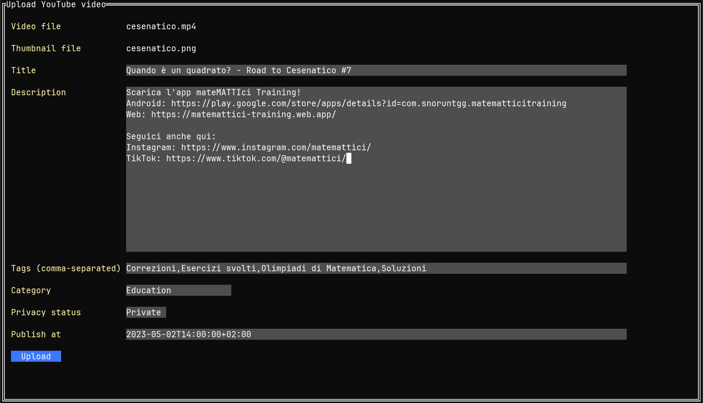

# ytup

A simple terminal user interface to quickly upload videos to YouTube, built with [tview](https://github.com/rivo/tview).



## Features

- Upload a video from the command line.
- Optionally add the thumbnail.
- Specify the video title, description, tags, category, privacy status and upload time.
- Import the title, description, tags and category from recently uploaded videos.

## Installation

#### Step 1: install the program

You should have Go installed.
Clone the repository, navigate to the corresponding folder and run

```
go install
```

This will install the program in you Go binaries folder, which in my case is `~/go/bin/`.
If you want to be able to run the program from anywhere, you should add this directory to your PATH.

#### Step 2: obtain authorization credentials

Navigate to [this link](https://developers.google.com/youtube/registering_an_application) and follow the instructions to obtain OAuth 2.0 credentials.
You should be able to download a json file that contains the required information. Save it to `~/.config/ytup/client_secret.json`.

#### Step 3 (optional): configure default settings

Create a default configuration file called `defaults.json` inside the directory `~/.config/ytup/` and add your preferred settings following the [instructions below](README.md#Default-settings).

## Usage

Assuming you have the executable in you PATH, run

```
ytup [-r] /path/to/video [/path/to/thumbnail]
```

If this is the first time you run the program, it will give you a link that you can copy and paste into your browser to authorize the request.
You will have to copy the code that is produced in the url bar to the terminal and press enter.

This will open up a TUI that allows you to import data from a recently uploaded video (if you want).
After that, you will be able to specify the title, description, tags, category, privacy status and upload time of your video.
Finally, you can press the "Upload" button to finalize the upload.
If you add the `-r` flag, the program will not request the list of recently uploaded videos (which costs 100 API quotas), but instead it will read it from a local cache.

## Default settings

If you want, you can create a `defaults.json` file inside the directory `~/.config/ytup/` that contains the default settings that are applied if you don't import data from another video.
The file should contain the following data.

```
{
  "title": The default title
  "description": The default description
  "tags": The default tags, as an array of strings
  "category": The default video category, as one of the strings listed below
  "privacy_status": One among "private", "unlisted" and "public"
  "publish_time": The default publish time in your current timezone, as a string, in the format HHMM
}
```

The available categories are the following.

- Action/Adventure
- Anime/Animation
- Autos & Vehicles
- Classics
- Comedy
- Documentary
- Drama
- Education
- Entertainment
- Family
- Film & Animation
- Foreign
- Gaming
- Horror
- Howto & Style
- Movies
- Music
- News & Politics
- Nonprofits & Activism
- People & Blogs
- Pets & Animals
- Science & Technology
- Sci-Fi/Fantasy
- Short Movies
- Shorts
- Shows
- Sports
- Thriller
- Trailers
- Travel & Events
- Videoblogging

An example of a valid configuration file would be the following.

```json
{
  "title": "My default title",
  "description": "My default description.\nIcan also create a new line.",
  "tags": ["First tag", "Second tag", "Third tag"],
  "category": "Education",
  "privacy_status": "private",
  "publish_time": "1400"
}
```

## Quota cost

At the time of writing, YouTube gives you 10,000 quotas per day, and uploading one video through the API costs 1,600 quotas.
Additionally, you will spend 100 quotas for listing the 10 most recent videos (unless you use the `-r` flag) and 1 quota to get the video tags.

## Additional info

- The upload timestamp must be in ISO 8601 format.
- If you don't specify a publish date and time, the video will be uploaded but not scheduled.
- You can only schedule a video if the privacy status is set to private.

## Subscribe!

While you are here, subscribe to my YouTube channel [mateMATTIci](https://www.youtube.com/@mateMATTIci)!
